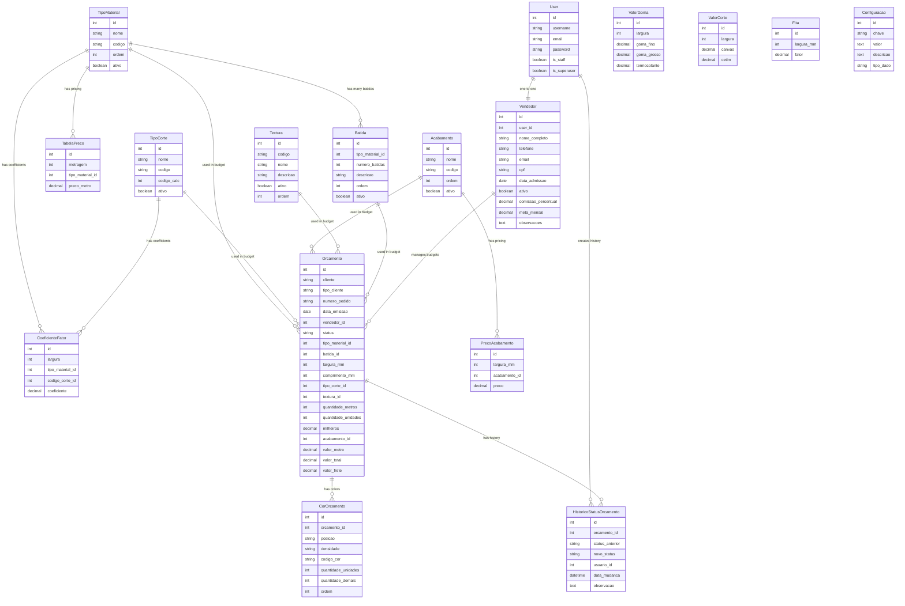

# Futura Cursor - Data Model Diagram

## Sistema de Orçamentos de Etiquetas Personalizadas

### 📊 Entity Relationship Diagram



---

## 📋 Model Summary

### 🎨 **1. Core Pricing & Material Tables**

These tables define the base materials, pricing, and calculation factors:

| Model | Purpose | Key Fields |
|-------|---------|------------|
| **TipoMaterial** | Types of materials (Tafetá, Sarja, Alta Definição) | nome, codigo, ativo |
| **Batida** | Weaving density options per material (20, 25, 28 batidas) | tipo_material_id, numero_batidas |
| **TipoCorte** | Cut types (Normal, Meio Corte, Dobra) | nome, codigo, codigo_calc |
| **TabelaPreco** | Price per meter by material and quantity range | metragem, tipo_material_id, preco_metro |
| **CoeficienteFator** | Calculation coefficients by width, material, and cut | largura, tipo_material_id, codigo_corte_id, coeficiente |

### 🎯 **2. Finishing & Additional Materials**

Tables for finishing options and special materials:

| Model | Purpose | Key Fields |
|-------|---------|------------|
| **Acabamento** | Finishing materials (Goma F, Goma G, Termocolante) | nome, codigo, ordem |
| **PrecoAcabamento** | Finishing prices by width | largura_mm, acabamento_id, preco |
| **ValorGoma** | Legacy glue values by width | largura, goma_fino, goma_grosso, termocolante |
| **ValorCorte** | Legacy special cut values | largura, canvas, cetim |
| **Textura** | Available textures for labels | codigo, nome, ativo |
| **Fita** | Ribbon/tape conversion factors | largura_mm, fator |

### 👥 **3. Users & Sales**

User management and sales tracking:

| Model | Purpose | Key Fields |
|-------|---------|------------|
| **User** | Django authentication (built-in) | username, email, is_staff, is_superuser |
| **Vendedor** | Sales person profile | user_id (OneToOne), nome_completo, comissao_percentual, meta_mensal |

**Key Features:**
- One User can be linked to one Vendedor (OneToOne relationship)
- Vendedores can belong to "Gestor" group for management permissions
- Tracks sales goals, commission, and performance

### 📝 **4. Budgets & Quotations**

The core business logic - creating and managing quotations:

| Model | Purpose | Key Fields |
|-------|---------|------------|
| **Orcamento** | Main budget/quotation | cliente, status, tipo_material_id, quantidade_metros, valor_total |
| **CorOrcamento** | Colors/variants for each budget | orcamento_id, posicao, densidade, codigo_cor, quantidade_unidades |
| **HistoricoStatusOrcamento** | Status change audit trail | orcamento_id, status_anterior, novo_status, usuario_id |

**Status Workflow:**
```
digitando → aguardando → aprovado → em_producao → finalizado → entregue
                ↓
            reprovado → [back to digitando]
                ↓
            cancelado (terminal state)
```

**Key Features:**
- Auto-calculates pricing based on material, dimensions, quantity
- Supports dual-density materials with multiple colors
- Full audit trail of status changes
- Permission-based editing (vendors can edit only in 'digitando' or 'reprovado' status)

### ⚙️ **5. System Configuration**

| Model | Purpose | Key Fields |
|-------|---------|------------|
| **Configuracao** | Global system settings | chave, valor, tipo_dado |

**Features:**
- Flexible key-value configuration storage
- Type-aware conversions (decimal, integer, text, boolean)

---

## 🔗 Key Relationships

### One-to-Many (1:N)
- `TipoMaterial` → `Batida` (one material type has many weaving densities)
- `TipoMaterial` → `TabelaPreco` (one material has prices for different quantities)
- `TipoMaterial` → `Orcamento` (one material used in many budgets)
- `Vendedor` → `Orcamento` (one vendor creates many budgets)
- `Orcamento` → `CorOrcamento` (one budget has many color variants)
- `Orcamento` → `HistoricoStatusOrcamento` (one budget has many status changes)

### One-to-One (1:1)
- `User` ↔ `Vendedor` (one user account per sales person)

### Many-to-One (N:1) from Budget perspective
- `Orcamento` → `TipoMaterial` (many budgets use one material)
- `Orcamento` → `Batida` (many budgets use one density option)
- `Orcamento` → `TipoCorte` (many budgets use one cut type)
- `Orcamento` → `Textura` (many budgets use one texture)
- `Orcamento` → `Acabamento` (many budgets use one finishing)
- `Orcamento` → `Vendedor` (many budgets belong to one vendor)

---

## 🎯 Business Logic Highlights

### Automated Calculations
The `Orcamento` model includes complex calculation logic in `calcular_valores()`:
- **Unidades** (units): Calculated from meters and dimensions
- **Milheiros** (thousands): `FLOOR(Unidades/1000, 2)`
- **Valor Metro** (price per meter): Based on `TabelaPreco` lookup
- **Valor Total** (total price): Complex calculation involving coefficients, finishing, etc.

### Access Control
- **Superusers/Gestores**: Can edit any budget except 'cancelado'
- **Vendedores**: Can edit only budgets in 'digitando' or 'reprovado' status
- Uses Django's built-in User and Groups system

### Data Integrity
- **Unique constraints**: Prevent duplicate materials, batidas, prices
- **Validators**: Ensure positive values for dimensions, quantities, prices
- **Cascading deletes**: Properly configured for related data
- **PROTECT constraints**: Prevent deletion of materials/types used in budgets

---

## 💡 Usage Example

**Creating a Budget Workflow:**
1. **Vendedor** logs in (User → Vendedor relationship)
2. Creates new **Orcamento** with:
   - Client info
   - Selects **TipoMaterial** (e.g., "Tafetá")
   - Selects **Batida** for that material (e.g., "28 batidas")
   - Selects **TipoCorte** (e.g., "Normal")
   - Specifies dimensions (largura_mm, comprimento_mm)
   - Specifies quantity (quantidade_metros)
   - Optionally selects **Textura** and **Acabamento**
3. System automatically:
   - Looks up **TabelaPreco** based on quantity range
   - Applies **CoeficienteFator** based on width and cut type
   - Calculates final prices
   - Saves to database
4. Adds **CorOrcamento** entries for different colors/densities
5. Changes status from 'digitando' → 'aguardando' (logged in **HistoricoStatusOrcamento**)
6. Gestor reviews and approves/rejects

---

## 📊 Statistics

- **Total Models**: 17
- **Relationships**: 15+ foreign keys
- **Core Business Model**: Orcamento (Budget)
- **Auxiliary Tables**: 11 (pricing, materials, finishing)
- **User Management**: 2 (User, Vendedor)
- **Audit Trail**: 1 (HistoricoStatusOrcamento)

---

## 🔧 Technical Notes

- **Framework**: Django ORM
- **Database**: SQLite (db.sqlite3)
- **Validation**: Django validators for MinValue, unique constraints
- **Auto-calculation**: Pre-save hooks in Orcamento model
- **Decimal precision**: Uses Python Decimal for financial calculations
- **Timestamps**: Auto-managed criado_em, atualizado_em fields
